# Brief

This School 42 project aims at building various services (db, wordpress, server, ...) on Docker. Everything is done within a Linux VM.

## Developed skills

and to a lesser extent : 

# Architecture

# Wiki

cf. https://github.com/codastream/inception/wiki
